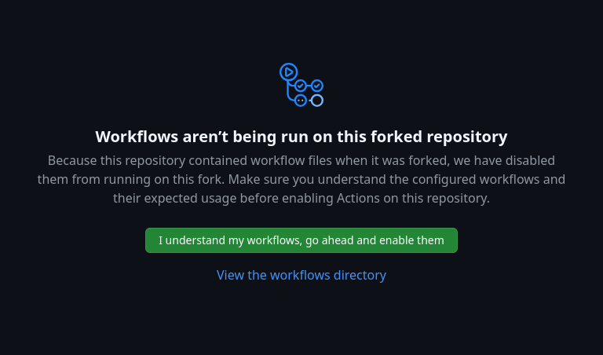
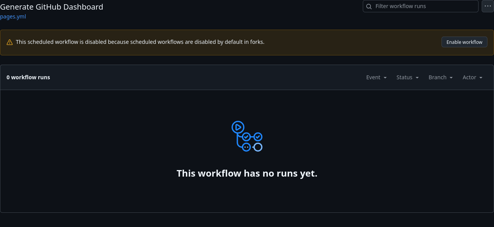
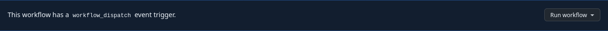
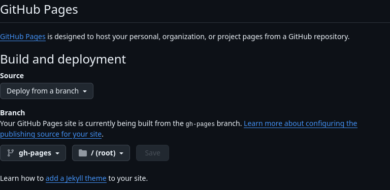

Set up a dashboard for your user/organization
=============================================

1. Fork this repository.
2. Enable "Github Actions" on your repository fork.
 - 
 - 
3. Manually trigger the workflow for the first time.
 - 
4. Enable github pages. Choose "Deploy from branch `gh-pages`."
 - 

Every day your dashboard will be re-generated automatically.